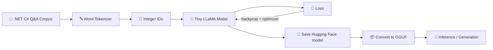
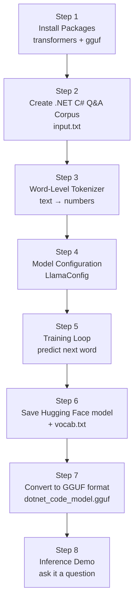
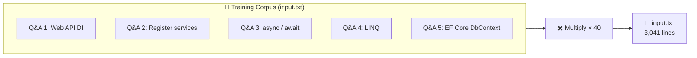
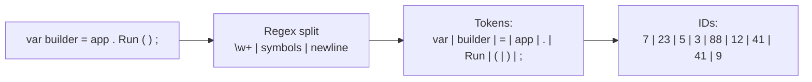
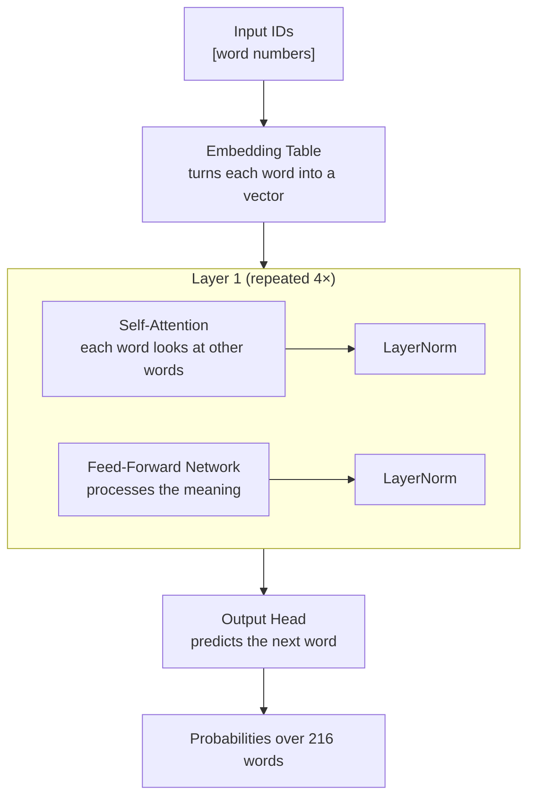
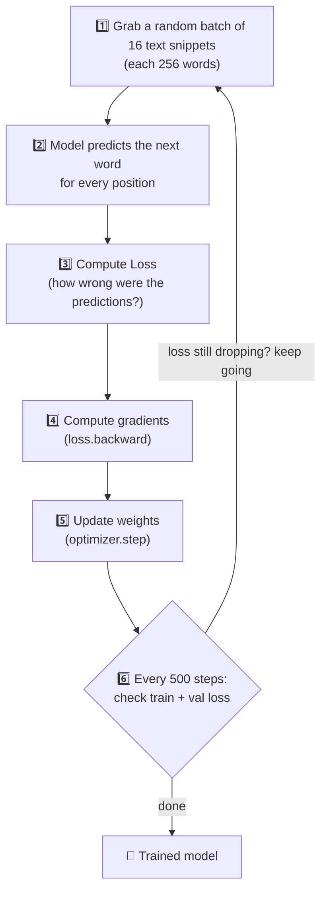
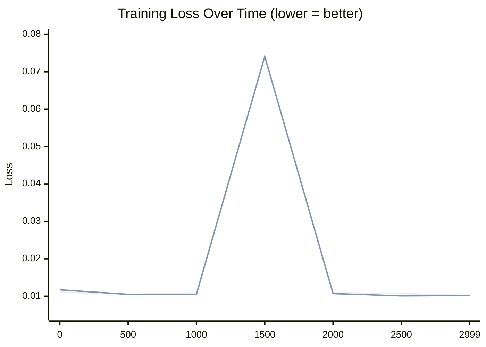
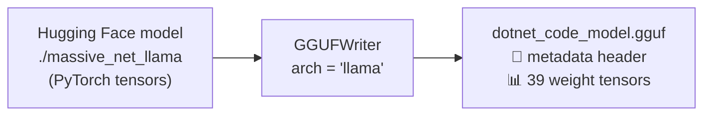

# 🧠 LLM from Scratch (Small Data)

> **Build a tiny GPT-style language model from zero, teach it to answer .NET C# questions, and export it to a portable GGUF file — all in one notebook.**

This project walks you through building a **real, working Large Language Model (LLM)** — not by calling an API, but by **building the whole thing step by step yourself**. It's small on purpose so you can see exactly what happens inside, run it on a laptop or Google Colab, and understand every piece.

---

## 📖 The Big Picture

Here is everything this project does in one picture:



**Read it like a story:**
1. We write some **C# questions and answers** (the "book" the model will learn from).
2. A **tokenizer** breaks the text into words and numbers each word.
3. A **tiny LLaMA transformer model** learns to predict the next word.
4. We **train** it until the loss (mistake rate) is very low.
5. We **save** the trained model, **convert** it to GGUF format, and **generate** answers.

---

## 🚂 The 8 Steps — Full Walkthrough

The notebook is a clean **8-step pipeline**. Each step feeds into the next:



### Step 1 — Install Packages 📦

```python
!pip install -q -U transformers gguf
```

- **`transformers`** (Hugging Face) — gives us the ready-made LLaMA architecture and training tools.
- **`gguf`** — lets us convert the model into the GGUF format used by `llama.cpp`.

> ℹ️ The project deliberately keeps the package list small. No heavy, rarely-used libraries.

---

### Step 2 — Create the .NET C# Q&A Corpus 📚

This is the model's "training book". It contains **5 realistic .NET/C# questions and answers** with code examples:

| # | Topic |
|---|-------|
| 1 | Web API Controller with **Dependency Injection** |
| 2 | Registering services (Transient / Scoped / Singleton) |
| 3 | **async / await** methods |
| 4 | **LINQ** queries (filter + project) |
| 5 | **Entity Framework Core** `DbContext` |

The data is written with **C# code blocks**, so the model learns not just English words but also code syntax like `{`, `}`, `=>`, and `;`.

To make a bigger dataset from this small source, the corpus is **repeated 40 times**:

```
5 Q&A pairs  ×  40 repeats  =  input.txt  (3,041 lines)
```



> ⚠️ **Note on honesty:** repeating the same 5 examples 40 times is *not* how real LLMs are trained — it's a trick to keep the demo small and fast. Real models train on billions of unique words. (More on this in [What You Learn](#-what-you-learn).)

---

### Step 3 — Word-Level Tokenizer 🔤

A tokenizer turns text into numbers, because a neural network can only work with numbers.

This project uses a **word-level tokenizer** (splitting on words and symbols) rather than a character-level one:

```python
token_pattern = r"\w+|[^\w\s]|\n"
```

Example — how the sentence `var builder = app.Run();` becomes numbers:



**Two lookup tables** connect words ↔ numbers:

- `word_to_int` — `"builder" → 23` (used for encoding / training)
- `int_to_word` — `23 → "builder"` (used for decoding / generation)

**Dataset stats after tokenizing:**

| Metric | Value |
|--------|-------|
| Total tokens in dataset | **26,640** |
| Vocabulary size (unique words & symbols) | **216** |
| Train / Val split | **90% / 10%** |
| `batch_size` | 16 |
| `block_size` (context length) | 256 words |

> 💡 `block_size = 256` was chosen deliberately — it's long enough to hold a full Q&A pair (~140 words) *plus* the next question, so the model sees complete examples. A shorter window (64) made answers blend together during generation.

---

### Step 4 — Model Configuration 🏗️

The model is a **real LLaMA-style transformer** built from the `LlamaConfig` class. It has **only 4 layers** — tiny compared to models like Llama 3 with dozens of layers.

| Setting | Value | What it means |
|---------|-------|----------------|
| `vocab_size` | 216 | number of words the model knows |
| `hidden_size` | 256 | size of each "thought vector" |
| `intermediate_size` | 2048 | hidden feed-forward width (extra memory for C# rules) |
| `num_hidden_layers` | 4 | transformer layers stacked on top of each other |
| `num_attention_heads` | 4 | attention "workers" looking at different words |
| `num_key_value_heads` | 4 | GQA heads for key/value |
| `max_position_embeddings` | 256 | longest sequence it can handle |
| `bos_token_id` / `eos_token_id` / `pad_token_id` | 0 / 1 / 2 | special marker tokens |

**Anatomy of the transformer** (this is what the model actually contains):



**In plain English:** each layer lets every word "look at" the other words in the sentence (self-attention) and then transforms the result (feed-forward). Stack 4 of those, and the model builds a rich understanding of the sequence — enough to predict the next word.

The optimizer is **AdamW** with a learning rate of `5e-4`.

---

### Step 5 — The Core Training Loop 🔁

This is where the "learning" happens. It repeats **3,000 times**:



The model's only job: **given 255 words, predict word #256**. Do this millions of times and the model internalizes patterns — including the C# Q&A structure.

**Actual training log (loss = mistake rate, lower is better):**

| Step | Train Loss | Val Loss |
|------|-----------|----------|
| 0    | 0.0111    | 0.0117   |
| 500  | 0.0105    | 0.0105   |
| 1000 | 0.0109    | 0.0105   |
| 1500 | 0.0740    | 0.0741   |
| 2000 | 0.0109    | 0.0107   |
| 2500 | 0.0107    | 0.0101   |
| 2999 | **0.0102**| **0.0102**|



The loss drops to **~0.01** — very low, which tells us the model has **memorized** the small corpus almost perfectly (train *and* validation, since they contain the same repeated examples).

> ℹ️ The spike at step 1500 is normal training noise — a randomly sampled batch of words that happened to be harder — and the model recovers immediately.

---

### Step 6 — Save the Hugging Face Model 💾

The trained weights are saved to a folder, plus a **`vocab.txt`** file with one token per line:

```
./massive_net_llama/
├── model.safetensors   (the 39 weight tensors)
├── config.json         (model settings)
└── vocab.txt           (216 word tokens, one per line)
```

> 🐛 **Bug fix worth noting:** an earlier version accidentally saved the *character* set instead of the *word* vocabulary — that mismatch would break any downstream loader. This version saves the real word-level vocab.

---

### Step 7 — Convert to GGUF Format 📦

GGUF is the file format used by **`llama.cpp`** — the popular engine that runs LLMs fully **offline, on a laptop CPU**.

The conversion writes the model's 39 tensors into a single portable file:

```
./dotnet_code_model.gguf   ←  the final portable model
```



Key GGUF metadata (must match Step 4 exactly):

| Metadata | Value |
|----------|-------|
| `context_length` | 256 |
| `embedding_length` | 256 |
| `block_count` | 4 |
| `tokenizer_model` | `no_vocab` (custom word-level tokenizer) |
| `bos/eos/pad` id | 0 / 1 / 2 |

> ℹ️ The `no_vocab` tokenizer flag tells llama.cpp: *"the model uses a custom word-level vocabulary — attach `vocab.txt` from Step 6 externally."* The standard llama.cpp tokenizers (BPE/sentencepiece) don't apply here.

---

### Step 8 — Inference Demo 🤖

Now we reload the trained model and **ask it a question**:

```
Prompt: Question: How do you register services in the .NET Dependency Injection container?
```

Generation uses **greedy decoding** (always pick the most likely next word, `temperature = 0`) and stops after 150 words, when a complete code fence (6 backticks) is found, or when the model starts a new `Question:`.

**What the model actually produced:**

```
Question: How do you register services in the. NET Dependency Injection container ?
Answer You services the. file the. file the ' Services, between, between, between,
use await to execution - until underlying completes
` ` csharp public Task()
...
```

**What the ground-truth answer is (from input.txt):**

```
Question: How do you register services in the .NET Dependency Injection container?
Answer: You configure services inside the Program.cs file using the WebApplicationBuilder's
Services collection, choosing between Transient, Scoped, or Singleton lifetimes.
```csharp
var builder = WebApplication.CreateBuilder(args);
builder.Services.AddTransient();
builder.Services.AddScoped();
builder.Services.AddSingleton();
var app = builder.Build();
app.Run();
```

> ⚠️ **Honest result:** the tiny model *memorized* the words (loss ≈ 0.01) but **generation is still fuzzy** — it mixes fragments from different examples and drops words. This is a real, expected limitation of a 4-layer model trained on 5 repeated Q&As. It's not a bug in the notebook; it's the reality of scale. The full code path works end-to-end — that's the point of the project.

---

## 🛠️ How to Run

### Option A — Google Colab (easiest)
1. Upload `llm-from-scratch-small-data.ipynb` to [Google Colab](https://colab.research.google.com).
2. Run all cells top-to-bottom. Training takes only a few minutes (CPU is fine, GPU is faster).
3. Outputs appear in the Colab filesystem:
   - `input.txt` — the training corpus
   - `./massive_net_llama/` — the Hugging Face model
   - `dotnet_code_model.gguf` — the portable GGUF model

### Option B — Local Jupyter
```bash
pip install torch transformers gguf jupyter
jupyter notebook
```

### Hardware requirements
| Resource | Requirement |
|----------|-------------|
| GPU | optional (CPU works) |
| RAM | a few GB |
| Training time | ~minutes |
| Disk | < 100 MB |

---

## ✅ What You Learn

This notebook teaches you the **full journey of a real LLM**:

| Concept | Where it lives |
|---------|----------------|
| How text becomes numbers | Step 3 — tokenizer |
| Transformer architecture (attention, feed-forward) | Step 4 — `LlamaConfig` |
| Training / backpropagation / loss | Step 5 — training loop |
| Saving & loading models | Step 6 — Hugging Face |
| Model format conversion | Step 7 — GGUF |
| Text generation (greedy decoding) | Step 8 — inference |

**Three big ideas to remember:**
1. **An LLM is just a "next-word predictor."** All the intelligence comes from learning patterns in text.
2. **Data quality and context length matter more than model size** at this scale (see the `block_size` bug fix).
3. **Small models memorize — they don't generalize.** This demo shows *how* an LLM works, not how to make a useful chatbot.

---

## 🚀 Ideas to Take It Further

Want to make it bigger and better? Try:

- **More unique data** — replace the 5 repeated Q&As with hundreds of different C# questions.
- **A character-level tokenizer** experiment — compare it against the word-level one.
- **Longer training** — raise `max_iters` and watch loss keep dropping.
- **Sampling** — switch `temperature = 0` to `0.7` for more varied (if less perfect) output.
- **Run the GGUF offline** — load `dotnet_code_model.gguf` in [llama.cpp](https://github.com/ggerganov/llama.cpp) or [Ollama](https://ollama.com) with `vocab.txt` as the tokenizer.

---

## 📂 File Reference

| File | Purpose |
|------|---------|
| `llm-from-scratch-small-data.ipynb` | The entire pipeline (8 steps) |
| `input.txt` | Generated training corpus (3,041 lines) |
| `massive_net_llama/` | Saved Hugging Face model + `vocab.txt` |
| `dotnet_code_model.gguf` | Portable GGUF model for llama.cpp |

---

## ⚠️ Disclaimer

This is an **educational project**. The model is intentionally tiny and trained on repeated data, so it can only parrot fragments of its training corpus. It is **not** a production model, and the "GGUF for llama.cpp" output is meant to demonstrate the conversion pipeline — attaching a real tokenizer (e.g. BPE) would be needed for robust use.

**Built with:** Python, PyTorch, Hugging Face Transformers, GGUF
